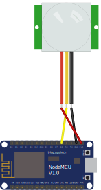

# ESP8266 MQTT PIR Sensor [](https://travis-ci.org/timmo001/ESP8266-MQTT-PIR-Sensor)
ESP8266 MQTT PIR Sensor. Compatible with Home Assistant's MQTT `sensor` and `binary_sensor`

## Hardware Example


## Software Setup
- Using Atom or VS Code, install [Platform IO](https://platformio.org/platformio-ide)
- Once setup, install the `esp8266` embedded platform
- Rename `src/setup-template.h` to `src/setup.h` and add your network, MQTT and lighting setup information. Take note of the `deviceName` you set. You will need this later to subscribe to MQTT messages.
- Build the project (Ctrl+Alt+B) and check for any errors

  > If the build produces an error referencing dependencies, You will need to manually install these libraries:
    - ArduinoJson
    - PubSubClient
- Upload to your board of choice (Ctrl+Alt+U). This project was created specifically for the `NodeMCU` but can be configured to work with another WiFi board with some tinkering.

## Example Home Assistant Configuration
This example creates a `binary_sensor` with an automation to brighten a `light_group`, if another light sensor is below a threshold and a someone is home, then dimming the lights after 10 minites if the PIR does not detect movement. This will only occur if the lights are still on.

```yaml
binary_sensor:
  platform: mqtt
  name: Kitchen PIR
  state_topic: sensor/pir001
  payload_on: 1
  payload_off: 0

automation:
  - alias: Kitchen Motion Detected
    trigger:
      - platform: state
        entity_id: binary_sensor.kitchen_pir
        to: 'on'
    condition:
      - condition: state
        entity_id: group.phones
        state: home
      - condition: numeric_state
        entity_id: sensor.sn1_ldr
        below: '450'
    action:
      - alias: Wake Kitchen lights
        data:
          entity_id: group.kitchen
          brightness_pct: 80
        service: light.turn_on
  
  - alias: 'Reset kitchen lights 10 minutes after last movement'
    trigger:
      platform: state
      entity_id: binary_sensor.kitchen_pir
      to: 'off'
      for:
        minutes: 10
    condition:
      - condition: state
        entity_id: group.phones
        state: home
      - condition: numeric_state
        entity_id: sensor.sn1_ldr
        below: '450'
      - condition: state
        entity_id: light.kitchen_room_lights
        state: 'on'
    action:
      service: homeassistant.turn_on
      entity_id: scene.reset_kitchen_lights
```
